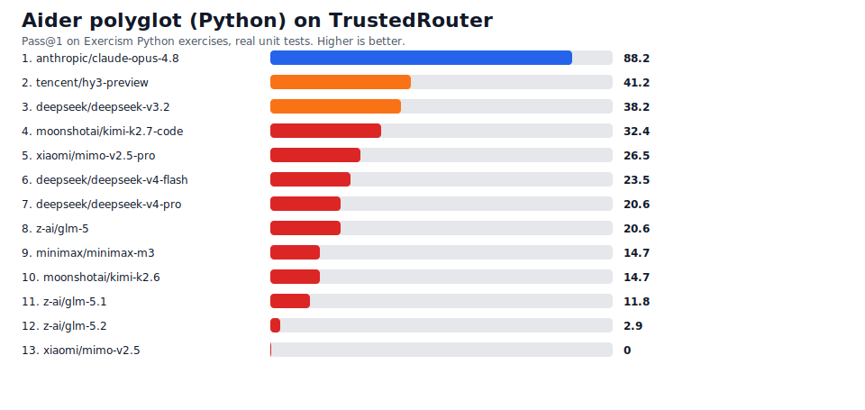

# TrustedRouter Benchmarks

Cheap, hard, *model-distinguishing* capability evals, run on the leading Chinese
open-weight models through the [TrustedRouter](https://trustedrouter.com) gateway
and published with an open, reproducible harness.

> [!WARNING]
> **Running these evals can get your account banned.** They route real prompts to
> upstream labs (Anthropic, OpenAI, Google, Z.ai, Moonshot, DeepSeek, etc.). High
> request volume — and, for some evals, edge-case content — can trip provider
> usage limits and get an API key **rate-limited, suspended, or banned**. Use a
> disposable key you are willing to lose, never your production or personal one.

## Why this repo

Public leaderboards under-cover the newest Chinese flagships and almost never run
the Western-built factuality / instruction-following evals on them. The goal here
is the data nobody else publishes:

1. the **latest Chinese open-weight models** (GLM-5, Kimi K2.7/K2-Thinking,
   DeepSeek V3.2/V4, Qwen3, MiniMax M3, Hunyuan, MiMo) on a fixed harness,
2. each eval run **solo and through TrustedRouter Fusion** — does fusing the
   open models beat the best single one, and beat frontier?
3. only evals that are **cheap** (small item counts, deterministic or short
   judges, no exotic infra) yet still **unsaturated** and **discriminating**.

Companion to [PrometheusBench](https://github.com/Lore-Hex/PrometheusBench)
(refusal/permissiveness) — that one measures whether a model *will* answer; these
measure whether it *can*.

## The panel

TrustedRouter model ids, in `trbench/panel.py`. Chinese open-weight models plus a
small Western frontier reference line. Prune to what your account routes.

## Evals

Picked from a deep-research sweep for signal-per-dollar × Chinese-model
separation × ease of faithful public replication. Full rationale and the
saturated benchmarks we deliberately skip are in [EVALS.md](EVALS.md).

| Eval | Measures | Scorer | Status |
|---|---|---|---|
| **IFEval** | instruction-following | deterministic Python verifiers (no judge) | ✅ runnable |
| **SimpleQA Verified** | closed-book factuality | LLM judge (no tools) | ✅ runnable |
| **Chinese SimpleQA** | Chinese-language factuality | LLM judge (no tools) | ✅ runnable |
| **Aider polyglot** | repo-edit coding | real unit tests (no judge) | ✅ runnable (Python subset) |
| **LiveCodeBench** | contamination-proof coding | date-filtered, code execution | planned |
| **tau2-bench** | agentic tool-use | upstream CLI (`--num-tasks`) | planned |
| **Terminal-Bench 2.0** | agentic terminal/coding | Docker harness (small-N subset) | planned |

GPQA Diamond is intentionally excluded — near-saturated at the frontier, so it
barely separates top models.

## Run IFEval

```bash
uv venv && uv pip install -e .
export TRUSTEDROUTER_API_KEY="sk-..."   # a throwaway key

# cheap smoke (first 20 prompts, a couple of models)
python -m trbench.evals.ifeval.run --models z-ai/glm-5.1,deepseek/deepseek-v4-pro \
  --prompt-limit 20 --out results/ifeval_smoke.json

# full panel (541 prompts)
python -m trbench.evals.ifeval.run --out results/ifeval.json

# score + render chart + splice into a README
python -m trbench.evals.ifeval.score results/ifeval.json \
  --svg assets/ifeval.svg --readme README.md
```

IFEval is the cheapest eval here: zero-shot, no system prompt, no judge model, no
sandbox — just 541 prompts scored by Google's deterministic verifiers.

<!-- IFEVAL_RESULTS_START -->
<!-- IFEVAL_RESULTS_END -->

## Methodology

- **Calibrated against published numbers.** Before trusting any new result, we
  run reference models with authoritative published scores and confirm the
  harness reproduces them (e.g. SimpleQA Verified `gemini-2.5-pro` should land on
  the published F1 of 55.6). See [CALIBRATION.md](CALIBRATION.md).
- **Faithful, not reinvented.** Each eval uses the canonical dataset and scorer.
  IFEval vendors Google's official verifiers verbatim (only the imports are made
  package-relative); see [NOTICE](NOTICE).
- **No judge where possible.** IFEval and Aider score deterministically; the
  factuality evals use a short LLM judge run with no tools.
- **Untrusted code is sandboxed.** Aider runs model-generated Python, so by
  default each test executes in a throwaway Docker container (`--network none`,
  read-only FS, caps dropped, non-root, memory/CPU/PID limits). `--sandbox host`
  falls back to the host (throwaway VM only); `--sandbox docker` requires it.
- Raw model outputs land in `results/` (gitignored — they can contain a lot of
  text). Publish the summary tables and SVG charts.

## License

Apache-2.0. Vendored IFEval verifiers are Apache-2.0 from
[google-research](https://github.com/google-research/google-research/tree/master/instruction_following_eval).

<!-- AIDER_POLYGLOT_RESULTS_START -->

Aider polyglot (Python subset) snapshot: `2026-06-17T13:21:24.049770+00:00`. 34 Exercism exercises, pass@1, real unit tests (no judge).



| Rank | Model | Pass% | Passed | Total | Errors |
|---:|---|---:|---:|---:|---:|
| 1 | `anthropic/claude-opus-4.8` | 88.2 | 30 | 34 | 0 |
| 2 | `tencent/hy3-preview` | 41.2 | 14 | 34 | 0 |
| 3 | `deepseek/deepseek-v3.2` | 38.2 | 13 | 34 | 0 |
| 4 | `moonshotai/kimi-k2.7-code` | 32.4 | 11 | 34 | 0 |
| 5 | `xiaomi/mimo-v2.5-pro` | 26.5 | 9 | 34 | 0 |
| 6 | `deepseek/deepseek-v4-flash` | 23.5 | 8 | 34 | 0 |
| 7 | `deepseek/deepseek-v4-pro` | 20.6 | 7 | 34 | 1 |
| 8 | `z-ai/glm-5` | 20.6 | 7 | 34 | 1 |
| 9 | `minimax/minimax-m3` | 14.7 | 5 | 34 | 0 |
| 10 | `moonshotai/kimi-k2.6` | 14.7 | 5 | 34 | 3 |
| 11 | `z-ai/glm-5.1` | 11.8 | 4 | 34 | 7 |
| 12 | `z-ai/glm-5.2` | 2.9 | 1 | 34 | 18 |
| 13 | `xiaomi/mimo-v2.5` | 0.0 | 0 | 34 | 0 |

<!-- AIDER_POLYGLOT_RESULTS_END -->
